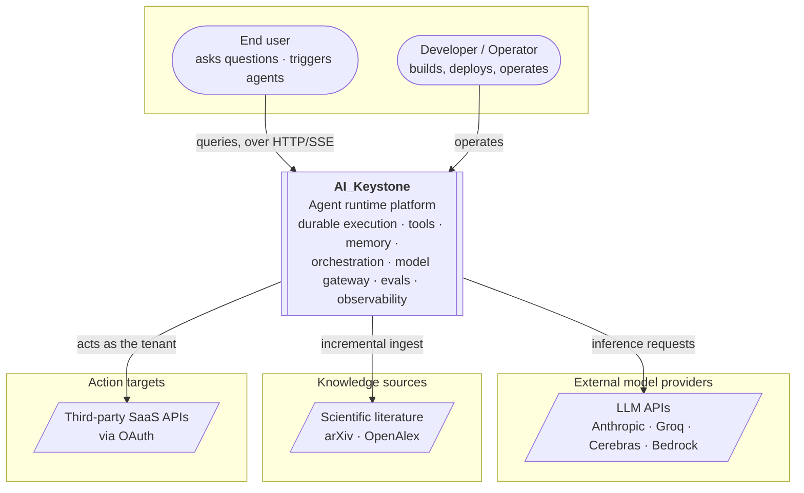

# C4 · Level 1 — System Context

> The system, its users, and the external systems it depends on. The highest-level view;
> container and component views (Levels 2–3) arrive from Phase 2 onward.
> C4 model reference: <https://c4model.com>.

## Diagram

## Actors

| Actor | Relationship |
| --- | --- |
| **End user** | Sends queries and triggers agent runs over HTTP with SSE streaming |
| **Developer / operator** | Builds, deploys, and operates the platform |

## External dependencies

| System | Why | Boundary concern |
| --- | --- | --- |
| **LLM APIs** | The reasoning substrate ("the CPU") | Rate limits, cost, outages → the model plane (Ph 7) |
| **Scientific literature** | The knowledge-heavy workload's corpus | Incremental sync, quality, dedup → the data plane (Ph 8) |
| **Third-party SaaS APIs** | The action-heavy workload's targets | OAuth, partial failure, schema drift → tool platform + action workload (Ph 4, 13) |

## Note

The two workloads (knowledge-heavy, action-heavy) exercise deliberately opposite external
boundaries — one stresses ingestion and retrieval, the other stresses tool execution and
credential isolation. That contrast is what makes the thing a platform rather than an app.
