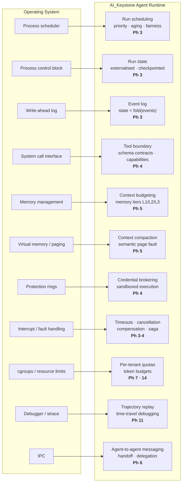

# The OS ↔ Agent Runtime Mapping

The governing analogy of AI_Keystone, as a diagram.

> **If the LLM is the CPU, AI_Keystone is the operating system.**

Each operating-system concept on the left maps to an agent-runtime component on the right, tagged
with the phase that builds it. The analogy is a design guide, not decoration — the
operating-systems literature is genuinely the theory behind each component.

## Where the analogy breaks

Worth stating, because the differences are where the engineering actually lives:

| | Operating system | Agent runtime |
| --- | --- | --- |
| **Addressing** | Exact — the MMU knows which page is absent | **Semantic** — absence must be inferred; retrieval is similarity-based, not equality |
| **Hardware support** | MMU, TLB, page tables in silicon | **None** — fault detection, handling, and the page table are all application code |
| **Miss cost** | Microseconds to milliseconds; latency only | 100ms–seconds, **plus money** (vector search + tokens) |
| **Failure mode** | Transparent — the program cannot tell | **Not transparent** — the wrong page produces a confidently wrong answer |

That last row is the significant one: OS paging is correctness-preserving, agent paging is
quality-affecting. There is no equivalent of "the page simply loaded correctly."

**Related:** [`../../foundations/os-to-agent-runtime.md`](../../foundations/os-to-agent-runtime.md)
